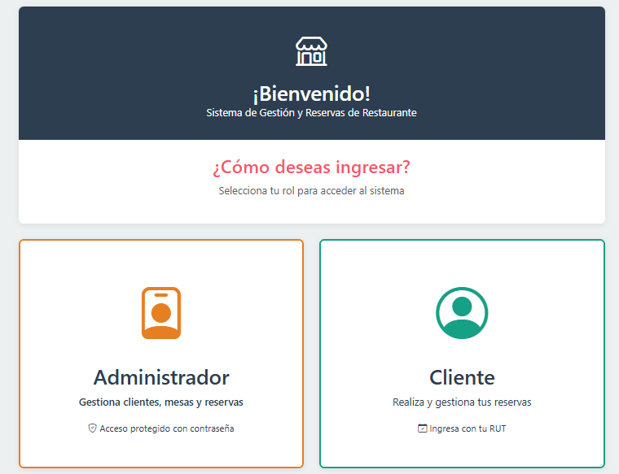
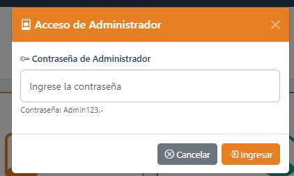
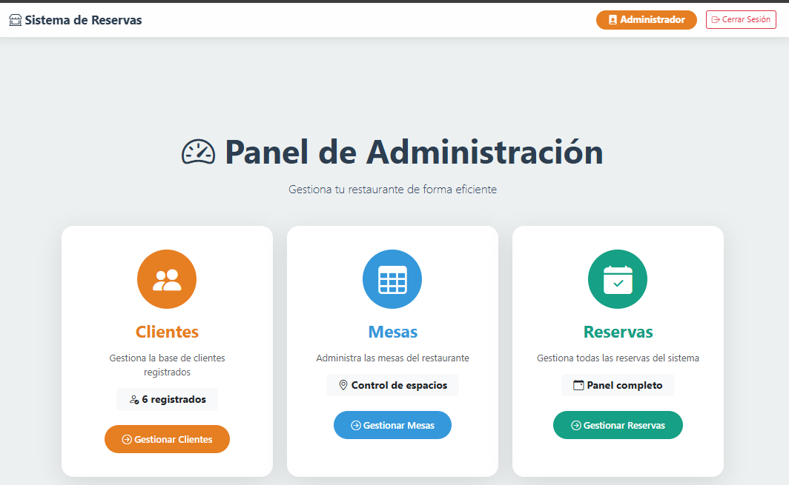
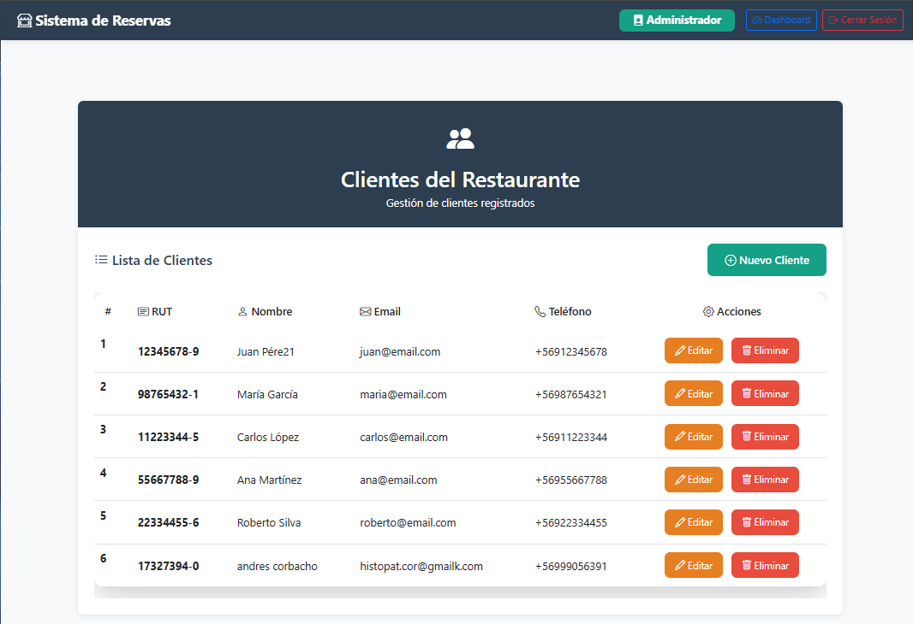
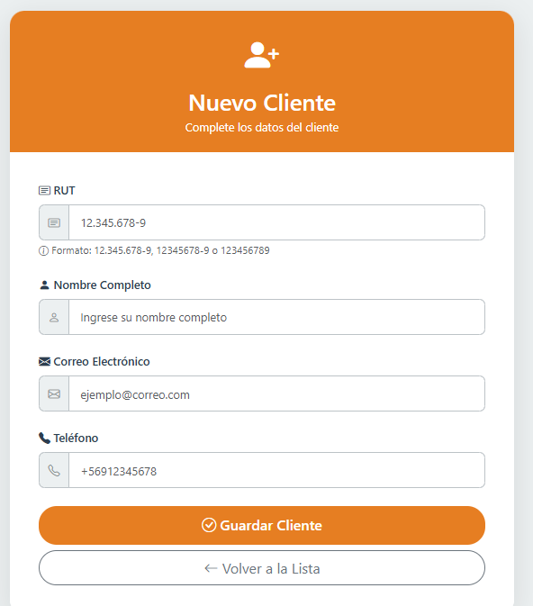

# 🍽️ Sistema de Reservas - Sabor Gourmet


## ✨ Características Principales

### 👨‍💼 Panel Administrador
- **Gestión de Clientes**: Crear, editar y listar clientes
- **Gestión de Mesas**: Crear, editar y gestionar disponibilidad de mesas
- **Gestión de Reservas**: Crear, editar, listar y cancelar reservas
- Dashboard con estadísticas rápidas

### 👤 Panel Cliente
- **Mis Reservas**: Ver y cancelar reservas propias
- **Nueva Reserva**: Crear reservas seleccionando mesa y fecha/hora
- **Mi Perfil**: Ver datos personales

## 🛠️ Tecnologías

- **Backend**: Spring Boot 3.5.7 con Java 21
- **Frontend**: Thymeleaf + Bootstrap 5.3.0
- **Base de Datos**: H2 (en memoria)
- **Build**: Maven
- **IDE Recomendado**: VS Code con Java Extension Pack

## 📋 Requisitos

- Java 21 o superior
- Maven 3.6+

## 🚀 Instalación y Ejecución

### 1. Clonar o descargar el proyecto
```bash
cd eva2
```

### 2. Compilar
```bash
./mvnw clean install
```

### 3. Ejecutar
```bash
./mvnw spring-boot:run
```

### 4. Acceder
- **URL**: http://localhost:8080

## 🔐 Credenciales

### Administrador
- **Contraseña**: `Admin123.-`

### Cliente
- **RUT**: Cualquiera de los precargados o crear nuevo
  - Ejemplos: `12345678-9`, `98765432-1`, etc.
- **Ingreso**: Automático con RUT (se crea cuenta si no existe)


## 📝 Funcionalidades por Rol

### Administrador
| Función | Ruta | Método |
|---------|------|--------|
| Listar clientes | `/clientes` | GET |
| Nuevo cliente | `/clientes/formulario` | GET |
| Guardar cliente | `/clientes/guardar` | POST |
| Listar mesas | `/mesas` | GET |
| Listar reservas | `/reservas` | GET |
| Nueva reserva | `/reservas/nuevo` | GET |
| Editar reserva | `/reservas/editar/{id}` | GET |

### Cliente
| Función | Ruta | Método |
|---------|------|--------|
| Mi panel | `/cliente/dashboard/{id}` | GET |
| Mis reservas | `/reservas/mis-reservas/{clienteId}` | GET |
| Nueva reserva | `/reservas/nueva/{clienteId}` | GET |
| Guardar reserva | `/reservas/guardar-cliente/{clienteId}` | POST |
| Cancelar reserva | `/reservas/cancelar/{id}/{clienteId}` | GET |

## 🗄️ Base de Datos

### Tablas
- **CLIENTE**: id, rut, nombre, email, telefono
- **MESA**: id, numero, capacidad, disponible
- **RESERVA**: id, cliente_id, mesa_id, fecha_hora

### Datos Iniciales
- 5 clientes precargados
- 8 mesas precargadas (2, 4, 6, 8 personas)
- 5 reservas de ejemplo

## 🔧 Configuración

### application.properties
```properties
server.port=8080
spring.datasource.url=jdbc:h2:mem:sabor_gourmet
spring.jpa.hibernate.ddl-auto=create-drop
spring.sql.init.mode=never
```

## ⚙️ DataLoader

Se ejecuta una sola vez al iniciar si la tabla de clientes está vacía. Carga:
- 5 clientes de ejemplo
- 8 mesas
- 5 reservas de muestra
---

## 📸 Capturas de Pantalla












Captura donde se evidencia el funcionamiento de la APP
